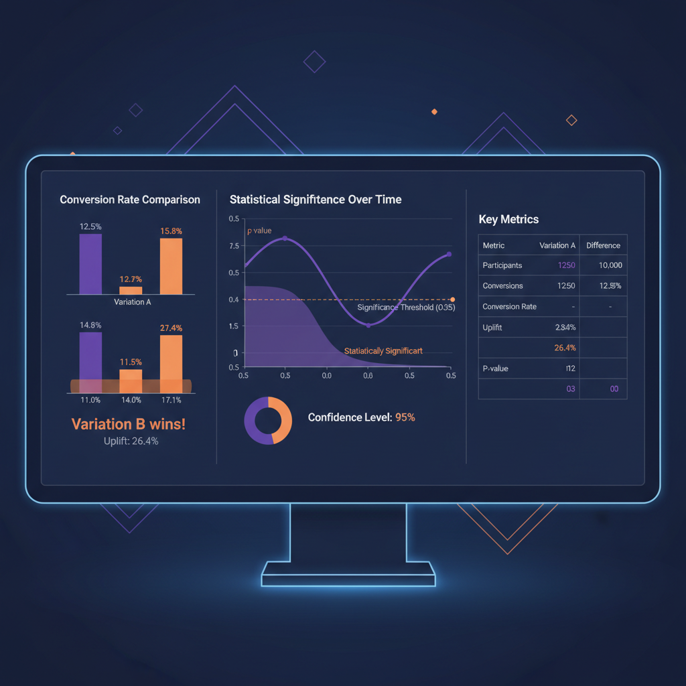

# A/B Testing Framework

Фреймворк для проведения A/B тестов с автоматическим расчетом статистической значимости и визуализацией результатов. Обеспечивает надежную оценку эффективности изменений и помогает принимать data-driven решения.

## Methodology
- Разработка гипотез и выбор метрик
- Расчет размера выборки для достижения статистической мощности
- Проведение тестов с контролем за качеством данных
- Статистический анализ результатов (t-тесты, chi-square)

## Tools
- Python
- SciPy/Statsmodels
- Pandas
- Matplotlib/Seaborn
- Jupyter Notebook

[GitHub](https://github.com/NikitaBoyarkin/ab-testing-framework)