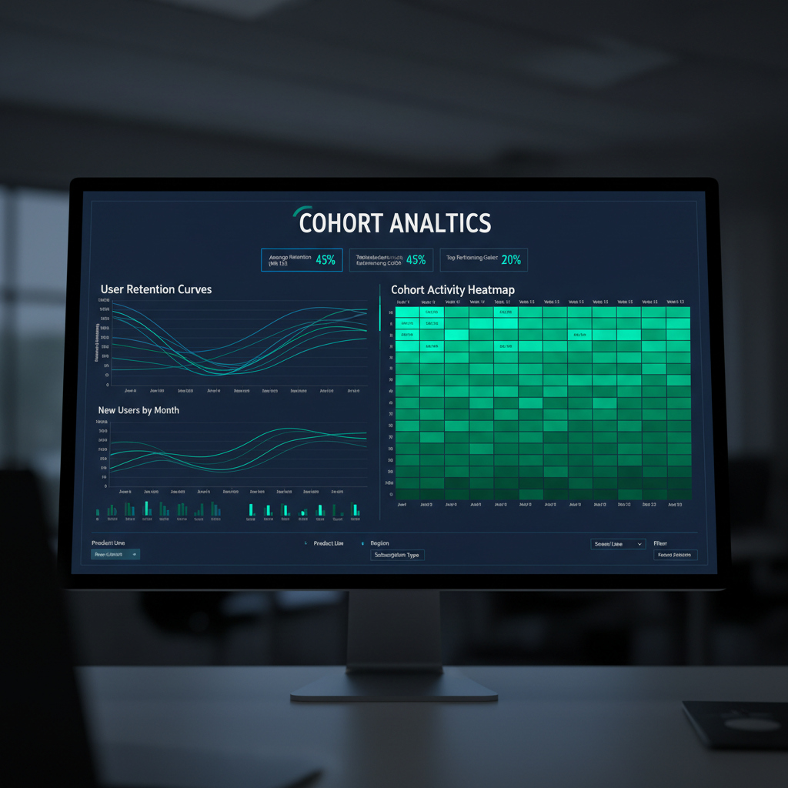

# Cohort Analysis Dashboard

Когортный анализ клиентов для понимания поведения и удержания пользователей. Дашборд позволяет отслеживать ключевые метрики удержания по когортам и выявлять тренды в поведении клиентов.

## Methodology
- Разделение клиентов на когорты по дате регистрации
- Расчет метрик удержания и конверсии
- Анализ жизненного цикла клиентов
- Выявление паттернов оттока

## Tools
- Python
- Pandas
- Plotly/Dash
- SQL
- Tableau

[GitHub](https://github.com/NikitaBoyarkin/cohort-analysis)